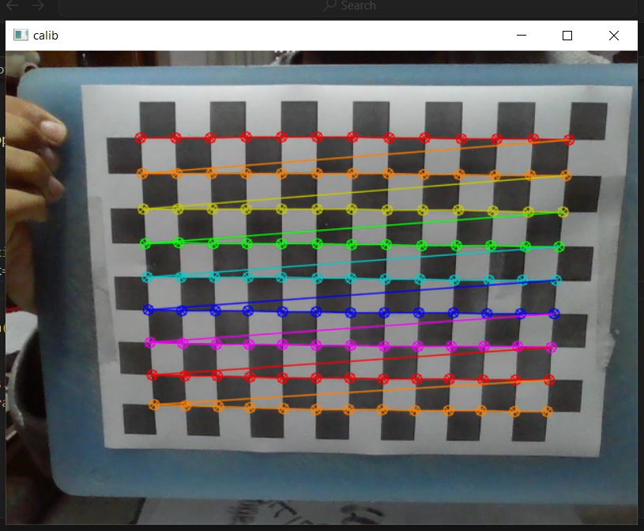

# Ultra-Cam-Fusion

Project-based tutorial that **projects an object’s physical 3-D position—measured with an HC-SR04 ultrasonic sensor mounted on a servo—onto a live USB-camera feed**.

<p align="center">
      #name the photo as overlay_example.png
</p>

---

import cv2


## code addition to sweep between cameras -->
 0 for laptop cam, 1 for iPhone camera (via iVCam)
cam_index = 0  # Start with laptop cam

cap = cv2.VideoCapture(cam_index)

while True:
    ret, frame = cap.read()
    if not ret:
        print("Failed to grab frame")
        break
    
    cv2.imshow('Camera Feed', frame)

    key = cv2.waitKey(1)

    if key == ord('q'):  # Press 'q' to quit
        break
    elif key == ord('s'):  # Press 's' to switch camera
        cam_index = 1 if cam_index == 0 else 0  # Toggle between 0 and 1
        cap.release()
        cap = cv2.VideoCapture(cam_index)

cap.release()
cv2.destroyAllWindows()
####


## 1. Features

* Servo sweeps in polar angle, HC-SR04 returns distance `r`  
* Python host converts `(θ, r)` → Cartesian `(x, y, 0)` (sensor frame)  
* 4×4 rigid transform **T<sub>sc</sub>** maps sensor frame → camera frame  
* Intrinsics **K** from OpenCV chessboard calibration  
* Perspective projection and overlay in real-time (≈ 25 FPS)  
* Optional YOLOv8 inference for visual verification  
* Cross-platform: Arduino ⇄ Windows / Linux / macOS

---


## 2. Hardware Bill-of-Materials

| Qty | Item                           | Notes                          |
|----:|--------------------------------|--------------------------------|
| 1   | Arduino Uno / Nano             | 5 V microcontroller            |
| 1   | HC-SR04 Ultrasonic Module      | Distance 2 cm – 4 m            |
| 1   | SG90 9 g Servo                 | 0–180 ° PWM                    |
| 1   | USB Webcam                     | 720 p or better                |
| 1   | 5 V ≥2 A PSU                   | Servo + Arduino power          |
| —   | Dupont wires, breadboard, etc. |                                |


### Wiring
      +5 V ──────────────┐────────  Servo  Vcc
                        ( )        HC-SR04  Vcc
      GND ──────────────┴─┐──────  Servo  Gnd
                          └─ Gnd   HC-SR04  Gnd
      Arduino D9  ───────────▶  Servo  Signal
      Arduino D2  ───────────▶  HC-SR04  Trig
      Arduino D3  ◀───────────  HC-SR04  Echo

      
---


## 3. Repository Layout
ultra-cam-fusion/
│
├─ arduino/ # .ino firmware
├─ python/ # host-side scripts
│ ├─ calib_capture.py
│ ├─ calc_Tsc.py
│ ├─ live_projection.py
│ └─ requirements.txt
├─ data/ # generated calibration artefacts
│ ├─ camera_params.npz
│ └─ T_sc.npy
├─ docs/ # report & figures
├─ media/ # demo video (Git LFS)
└─ README.md


---


## 4. Quick-Start (Windows / PowerShell example)

```powershell
# 1. Clone and create venv
git clone https://github.com/<you>/ultra-cam-fusion.git
cd ultra-cam-fusion
python -m venv .venv
.venv\Scripts\Activate.ps1
pip install -r python\requirements.txt

# 2. Flash Arduino
start arduino\arduino_scan.ino   # opens in Arduino IDE → select board/port → Upload

# 3. Camera calibration (print or display chessboard)
python python\calib_capture.py   # SPACE = capture, ESC = finish

# 4. Compute sensor→camera transform (edit pts then run)
python python\calc_Tsc.py

# 5. Live overlay
python python\live_projection.py --port COM4          #(replace COM4 with the actual port; use /dev/ttyACM0 on Linux)


5. Calibration Details
Intrinsic K & distortion
calib_capture.py detects a chessboard with --rows, --cols, --square options
→ saves data/camera_params.npz.
Extrinsic Tsc
Place a visible reflector, record ≥3 correspondences in calc_Tsc.py, run to save data/T_sc.npy.


6. Troubleshooting
Symptom	Fix
Red dot bows or drifts toward corners	Undistort frame or ensure dist is loaded correctly
No serial data	Wrong COM port / permissions / board reset
HC-SR04 jitter > 5 cm	Add delay(50) after trigger, shield sensor from wind
IntelliSense #include errors in VS Code	Install VS Code Arduino extension or ignore squiggles


7. License
MIT – see LICENSE.


Built as part of the “Sensor Fusion Section” at [Alexandria University] using OpenCV and the Ultrasonic/Servo libraries.